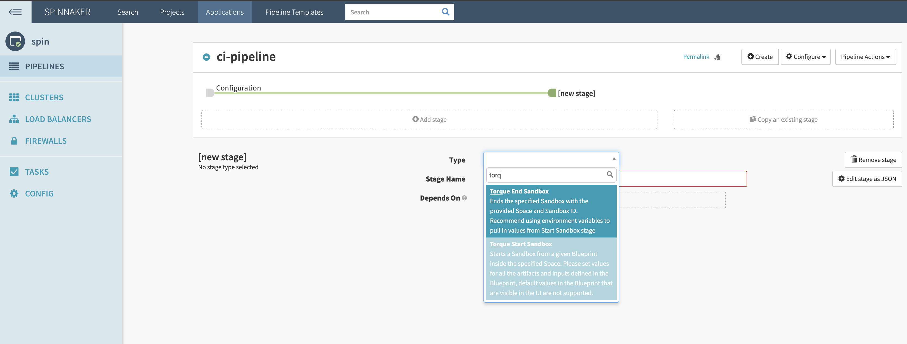
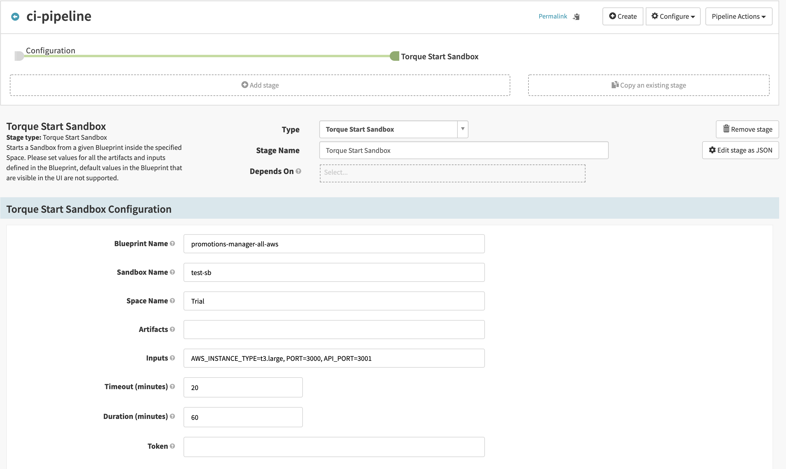
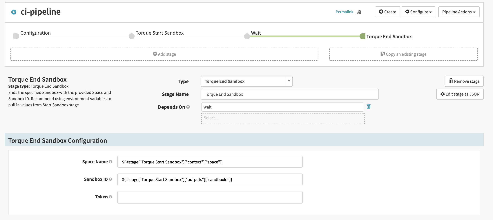

[](https://github.com/QualiTorque/torque-spinnaker-plugin/actions/workflows/build.yml)
[](https://opensource.org/licenses/Apache-2.0)


## Torque Plugin for Spinnaker

This plugin integrates Torque into your Pipelines in Spinnaker 1.23.0 and above.


## Plugin Deployment Guide for Spinnaker

1. Add the following to the Halyard config (typically found at `~/.hal/config`) to load the Orca backend. 
```yaml
  spinnaker:
    extensibility:
      plugins:
        Quali.TorqueSandboxPlugin:
          id: Quali.TorqueSandboxPlugin
          enabled: true
          version: <<VERSION NUMBER>>
          config:
              torqueToken: <<API Token (Not Required) >>
              torqueUrl:  <<API URL (Not Required) Default= https://qtorque.io >>
              account: <<Torque Sub Domain (Not Required)  >>
      repositories:
        TorqueRepo:
          id: S3Repo
          url: https://raw.githubusercontent.com/QualiTorque/torque-spinnaker-plugin/master/plugins.json
```
>Note: torqueToken is the authentication token used by default but is no longer required. You can specify the Torque token used by each stage in the Spinnaker pipeline.

2. Add the following to `gate-local.yml` in the necessary [profile](https://spinnaker.io/reference/halyard/custom/#custom-profiles) to load the Deck frontend
```yaml
spinnaker:
 extensibility:
    deck-proxy:
      enabled: true
      plugins:
        Quali.TorqueSandboxPlugin:
          enabled: true
          version: <<VERSION NUMBER>>
    repositories:
      TorqueRepo:
        url: https://raw.githubusercontent.com/QualiTorque/torque-spinnaker-plugin/master/plugins.json
```
3. Execute `hal deploy apply` to deploy the changes.
4. You should now be able to see 2 new stages provided by this plugin (Torque Start and End Sandbox) in the Deck UI when adding a new stage to your pipeline.

## How To Build

* clone a [torque-api-client-java](https://github.com/QualiTorque/torque-api-client-java)
* Build and install **torque-api-client-java** into local Maven repository using `mvn install` command from its dir
* go back to **torque-spinnaker-plugin** folder and run `./gradlew releaseBundle`

## Usage

After installation, you will have two stages added to your Spinnaker stages list:




### Start Sandbox Stage




**Blueprint Name** - Provide the name of the blueprint to be used as a source for the sandbox.

**Sandbox Name** - Provide a name for the sandbox.

**Space Name** - The name of the Torque Space your repository is connected to.

**Inputs** - [Optional] You can provide the blueprint's inputs as a comma-separated list of key=value.
For example: key1=value1, key2=value2.

**Timeout** - Set the timeout to wait (in minutes) for the sandbox to become active. If not set, an 
action just starts a sandbox and returns its ID without waiting for 'Active' status.

**Duration** - Set the sandbox duration in minutes. The sandbox will automatically de-provision at 
the end of the provided duration.

**Token** - [Optional] Provide the long term Torque token, if you want to override the default one which is set in the global configuration. You can generate it in Torque > Settings > Integrations or via the REST API.

### Stage ouputs

In your later stages you can use the following data generated by "Torque Start Sandbox" stage:

- sandboxId - an ID of started Torque sandbox. Could be referenced by:

  ```${ #stage("Torque Start Sandbox")["outputs"]["sandboxId"]}```

- sandboxUrl - a Sandbox permalink. Available if Torque account is set in global configuration.
Could be referenced by:: 

  ```${ #stage("Torque Start Sandbox")["outputs"]["sandboxUrl"]}```

- SandboxDetails - Json object which contains full details of launched sandbox.
Could be referenced by:

  ```${ #stage("Torque Start Sandbox")["outputs"]["SandboxDetails"]}```.

  Example json:
  ```
  {
      "id":"8nxzgyg26203c1",
      "name":"demoSb",
      "blueprint_name":"Jenkins",
      "applications":
      [
        {
          "name":"jenkins",
          "shortcuts":
          [
            "http://sandb-MainA-51RZLQWVANAI-1610354864.us-west-1.elb.amazonaws.com:8080"
          ],
          "status":"Done"
        }
      ],
      "sandboxStatus":"Active",
      "sandboxErrors":[]
    }
  ```
- QuickLinks - Json object with a list of quick links per each application.
Could be referenced by:

  ```${ #stage("Torque Start Sandbox")["outputs"]["QuickLinks"]}```.
  
  Example json:
  ```
  [
    {
      "name":"app1",
      "shortcuts":
      [
        "http://sandb-MainA-51RZLQWVANAI-1610354864.us-west-1.elb.amazonaws.com:8080"
      ],
      "status":"Done"
    },
    {
      "name":"app2",
      "shortcuts":
      [
        "http://sandb-MainA-51RZL1DVANAI-1243454864.us-west-1.elb.amazonaws.com:5050"
      ],
      "status":"Done"
    }
  ]
  ```

### End Sandbox Stage



**Space Name** - The name of the Torque Space your repository is connected to. You can use the following expression in order to take the space value from "Start Sandbox" stage: 
*`${ #stage("Torque Start Sandbox")["context"]["space"]}`*

**Sandbox ID** - Provide the ID of the sandbox you want to end. In most cases you will take it from Start Sandbox Stage context: *`${ #stage("Torque Start Sandbox")["outputs"]["sandboxId"]}`*

**Token** - [Optional] Provide the long term Torque token, if you want to override the default one which is set in the global configuration. You can generate it in Torque > Settings > Integrations or via the REST API.

## License
[Apache License 2.0](https://github.com/QualiSystems/shellfoundry/blob/master/LICENSE)
